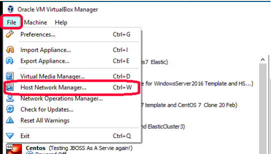
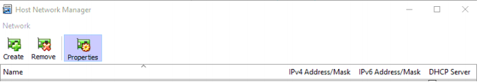
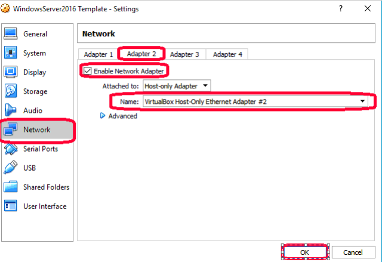
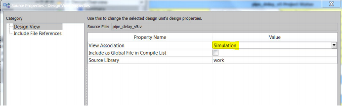

# 16BitMipsVHDL <!-- omit in toc -->

Bilgisayar Mimarisi Proje Ödevi - 2019

> PDF için [buraya](./16BitMipsVHDL.pdf) bakabilirsin.

| İsim                     | Öğrenci No |
| ------------------------ | ---------- |
| Yunus Emre Ak            | 1306150001 |
| Sefa Yalçındağ           | 1306150069 |
| Ahmet Demir              | 1306150003 |
| Muhammed Furkan Yıldırım | 1306150032 |

## İçerikler <!-- omit in toc -->

- [Tanıtım](#Tan%C4%B1t%C4%B1m)
  - [Birebir Varsayımsal Eşleştirilmiş Hali](#Birebir-Varsay%C4%B1msal-E%C5%9Fle%C5%9Ftirilmi%C5%9F-Hali)
  - [İstenilene Göre Sadeleştirilmiş Hali](#%C4%B0stenilene-G%C3%B6re-Sadele%C5%9Ftirilmi%C5%9F-Hali)
  - [Orjinal Hali](#Orjinal-Hali)
- [Gereksinimler](#Gereksinimler)
  - [XILINX ISE Design Studio](#XILINX-ISE-Design-Studio)
  - [XILINX Kullanımı](#XILINX-Kullan%C4%B1m%C4%B1)
    - [Proje Oluşturma](#Proje-Olu%C5%9Fturma)
    - [Proje İşlemleri](#Proje-%C4%B0%C5%9Flemleri)
    - [Simüle Etme](#Sim%C3%BCle-Etme)
  - [Teslim Şekli](#Teslim-%C5%9Eekli)
- [Çalışma Notları](#%C3%87al%C4%B1%C5%9Fma-Notlar%C4%B1)
  - [Hata Çözümleri](#Hata-%C3%87%C3%B6z%C3%BCmleri)
    - [VirtualBox Host only Adaptor Disappeared Hatası](#VirtualBox-Host-only-Adaptor-Disappeared-Hatas%C4%B1)
    - [Wait Statement Without UNTIL Clause not Supported for Synthesis Hatası](#Wait-Statement-Without-UNTIL-Clause-not-Supported-for-Synthesis-Hatas%C4%B1)
  - [Similasyon Notları](#Similasyon-Notlar%C4%B1)
  - [Eksiklik Notları](#Eksiklik-Notlar%C4%B1)
  - [VHDL Yapısı](#VHDL-Yap%C4%B1s%C4%B1)
- [Olası Sorunlar](#Olas%C4%B1-Sorunlar)
- [Yapılacaklar](#Yap%C4%B1lacaklar)
- [Harici Bağlantılar](#Harici-Ba%C4%9Flant%C4%B1lar)

<div class="page"/>

## Tanıtım

### Birebir Varsayımsal Eşleştirilmiş Hali


### İstenilene Göre Sadeleştirilmiş Hali


### Orjinal Hali


<div class="page"/>

## Gereksinimler

Proje ödevinin PDF'ine [buradan][Proje Ödevi] yararlandığım kaynağa [buradan][16bit Mips VHDL] ulaşabilirsin

- Grup sayısı 5 kişiliktir
- Son teslim tarihi: 15.05.2019 Çarşamba
- XILINX ISE Design Studio
- VHDL bilgisi

### XILINX ISE Design Studio

- Resmi sitesinde indirmek için [buraya][XILINX ISE Design Studio] tıklayabilirsin
  - Username: `yemreak`
  - Password: `yemreak.com1`
- **XILINX ISE Design Studio**'yu direkt olarak [buradan][XILINX ISE Design Studio - Direct] indirebilirsin.
- **Drive** üzerinden indirmek için [buraya][XILINX ISE Design Studio - Drive] bakabilirsin.

### XILINX Kullanımı

Hocanın hazırlamış olduğu videolar:

- [XILINX ile VHDL PROGRAMLAMA! - Full Adder (Tam Toplayıcı) Tasarımı #1](https://www.youtube.com/watch?v=-SZuTT3xa18)
- [XILINX ile VHDL PROGRAMLAMA! - Full Adder (Tam Toplayıcı) Tasarımı #2](https://www.youtube.com/watch?v=H7jihUQz-Io)
- [XILINX ile VHDL PROGRAMLAMA! - Full Adder (Tam Toplayıcı) Tasarımı #3](https://www.youtube.com/watch?v=Sw5ktjHl1zc)

> Alttaki bilgilerde yapılacak işlermler özetlenmiştir.

#### Proje Oluşturma

- `New Project`
- Top-level source type: `HDL`
- `XST`, `ISIM`, Preffered Language: `VHDL`

#### Proje İşlemleri

- `New Source` > `VHDL_module`
- Modülü boş bırakın devam edin.

#### Simüle Etme

- Similasyon oluşturmak için [buraya][XILINX ISE - Simulation] bakabilirsin.
  - `Start with a semantic of the top-level block`
- Simülasyona veri girişi için [buraya][ISIM Simulator] bakabailirsin.
  - `restart` Yeniden başlatma
  - `put <pbje_ismi> <değer>` Veri atama
    - Örn: `put tt_g1 0`
  - `run all` Hepsini çalıştırma

<div class="page"/>

### Teslim Şekli

- Similasyon sonuçları raporlanacak ve pdf haline getirilecek
- Verilen *instruction*'ların hepsi gerçekleştirilecek
- Sonuçlar similatörde gösterilecek
- PDF ile `.vhd` uzantılı kaynak kodlarını sisteme yüklenecek
  - Aksis - Döküman paylaşımı - Bilgisayar Mimarisi - Proje

## Çalışma Notları

- `mips.vhd` dosyası `Implement top level module` olarak çalıştırılmalı
- `testbench.vhd` dosyasının `Source` ayarlarında `All` yerine `Simulation` seçilmeli
- `add`, `sub`, `and`, `slt` gibi komutlar R type'dır, **ALU OP** ile gerçekleştirilir
- `X"..."` komutu 16bit anlamına gelmektedir
  - `x"000"` değeri `"000000000000"` (4*3 = 12 tane 0) değerine denktir
- Clock değerini otomatik olarak atamak için `isim force add {/mips_vhdl/clk} 1 -radix bin -value 0 -radix bin -time 100 ns -repeat 200 ns`

### Hata Çözümleri

#### VirtualBox Host only Adaptor Disappeared Hatası

`VirtualBox host only adaptor disappeared (Interface (‘VirtualBox Host-Only Ethernet Adapter’) is not a Host-Only Adapter interface (VERR_INTERNAL_ERROR) SOLVED` hatası için [buraya][Hata Çözümü 1] bakabilirsin.






<div class="page"/>

#### Wait Statement Without UNTIL Clause not Supported for Synthesis Hatası

`Error: wait statement without UNTIL clause not supported for synthesis` sorunu çözümü için [buraya][Wait until sorunu] bakabilirsin.



### Similasyon Notları

Similasyonu çalıştırmak için yazdığımız komutlar.

```isim
put reset 1
put clk 0
run
isim force add {/mips_vhdl/clk} 1 -radix bin -value 0 -radix bin -time 100 ns -repeat 200 ns
put reset 0
# 2.60us çalıştır
```

### Eksiklik Notları

- `Bne` komutu elden eklendiği (out sinyal oluşturulmadığı) için `Branch_ne_out` değişkeni bulunmamaktadır

<div class="page"/>

### VHDL Yapısı


## Olası Sorunlar

- 16Bit olması sorun teşkil edebilir

## Yapılacaklar

- [x] Baz alınan kaynağın test edilmesi gerek
- [x] VHDL kodları dosyalı yapı ile bu projeye yerleştirilecek

## Harici Bağlantılar

- [16bit Mips VHDL]
- [MIPS-Processor-VHDL - Github]
- [PiJoules/MIPS-processor]
- [dugagjin/MIPS]

[Proje Ödevi]: https://drive.google.com/open?id=1eWEJXmVy-XBVtcUSaC1gVu5lnZK-_lmq
[XILINX ISE Design Studio]: https://www.xilinx.com/support/download/index.html/content/xilinx/en/downloadNav/design-tools.html
[XILINX ISE Design Studio - Direct]: https://xilinx-ax-dl.entitlenow.com/dl/ul/2018/02/21/R209898474/Xilinx_ISE_S6_Win10_14.7_ISE_VMs_0206_1.zip/70f417f0787735862bdf9e9e3107e2af/5CC73BF4?akdm=0&filename=Xilinx_ISE_S6_Win10_14.7_ISE_VMs_0206_1.zip
[XILINX ISE Design Studio - Drive]: https://drive.google.com/open?id=1-4j-ZBZmA5axu2G3ebxcITROWsR2IUny
[XILINX ISE - Simulation]: https://youtu.be/H7jihUQz-Io?t=637
[ISIM Simulator]: https://youtu.be/Sw5ktjHl1zc?t=576
[Hata Çözümü 1]: https://darrenoneill.eu/?p=627
[Wait until sorunu]: https://forums.xilinx.com/t5/General-Technical-Discussion/Error-wait-statement-without-UNTIL-clause-not-supported-for/m-p/496314/highlight/true#M19498

[16bit Mips VHDL]: https://www.fpga4student.com/2017/09/vhdl-code-for-mips-processor.html
[MIPS-Processor-VHDL - Github]: https://github.com/cm4233/MIPS-Processor-VHDL
[PiJoules/MIPS-processor]: https://github.com/PiJoules/MIPS-processor
[dugagjin/MIPS]: https://github.com/dugagjin/MIPS

## 💖 Destek ve İletişim

​[​​](https://github.com/yedhrab) [​​](https://www.linkedin.com/in/yemreak/) [​​](https://yemreak.com/) [​​](mailto::yedhrab@gmail.com?subject=16BitMipsVHDL%20%7C%20Github)​

​[​](https://www.patreon.com/yemreak/)

## 🔏 Lisans

**The** [**Apache 2.0 License**](https://choosealicense.com/licenses/apache-2.0/) **©️ Yunus Emre Ak**


